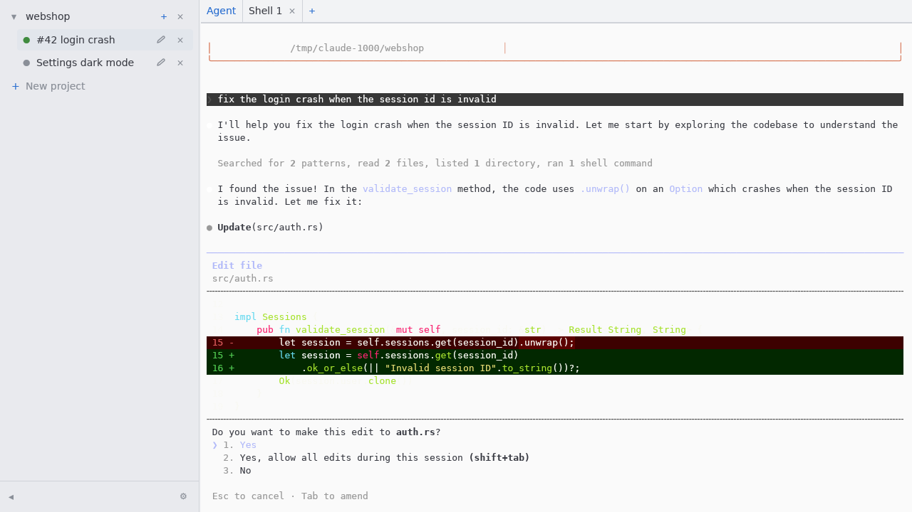

# Harmonium

[](https://github.com/tehrengruber/harmonium/actions/workflows/ci.yml)
[](https://github.com/tehrengruber/harmonium/actions/workflows/packages.yml)

A GPUI-based agent orchestrator: a terminal emulator with orchestration UI on
top. Manage projects (git repositories), spawn coding agents (claude-code)
into per-branch git worktrees derived from a plain-language task description,
and interact with each agent through an embedded terminal.



## How it works

Projects are git repositories. Spawning an agent asks an LLM to turn the task
description into a workspace — an existing branch or PR checked out in a
worktree, a fresh kebab-case branch off the default branch, or the project's
base checkout — and to name the agent (`#<PR number> <summary>` for PR work,
open PRs come from `gh pr list` when available). The preset's command then
runs there in an embedded PTY with the task appended as its last argument.

The **Workspace** row in the spawn dialog decides how much of that is left to
the LLM. *Auto* is the above. *New worktree* always puts the agent on a branch
of its own, keeping the branch name the LLM suggested (or deriving one from
the agent's name when it wanted the base checkout). *Main branch* always uses
the project's own checkout, with no branch or worktree of its own. **The agent
name is LLM-derived in every mode** — the planner runs regardless, only its
workspace decision is overridden. The dialog opens on *Auto* every time: a
forced workspace applies to the task you are spawning, not to the next one.
The preset, in contrast, is remembered. A
preset is a named spawn command, resume command and environment; the defaults cover
plain `claude` plus the sandboxed
[claude-isol](https://github.com/tehrengruber/claude-container-isolation)
variants. If planning fails, the error is shown in the dialog and no agent or
branch is created.

Each agent has its own agent terminal plus any number of shell tabs in the
same workdir. Shell scrollback is written to disk on exit and replayed above
the new prompt on the next start, colors included. Terminals are restored
lazily — nothing spawns until an agent is selected, and its session then
restarts with the preset's resume command; a *Resume session* button restarts
it if it exits.

Worktrees live under `~/.local/share/harmonium/worktrees/<repo>-<hash>/<branch>`
and state in `~/.local/share/harmonium/state.json`.

Removing an agent (the `×` in the sidebar) deletes its worktree too, but only
if that worktree is **clean** — staged, modified or untracked files block the
removal with a message naming the directory, since killing the session and
deleting the checkout has no undo. Ignored files (build output) don't count.
The **branch is kept**, so anything committed there survives and a later task
on the same branch picks up where this one left off. Nothing is deleted for a
base-mode agent (it runs in the project's own checkout) or when a second agent
shares the same worktree.

## Keyboard & mouse

Only the parts that aren't obvious from the UI:

- `ctrl-shift-c` / `ctrl-shift-v` copy and paste in a terminal — plain
  `ctrl-c`/`ctrl-v` belong to the program. A copy includes the selected
  parts that are scrolled out of view.
- Dragging past the top or bottom edge auto-scrolls and keeps extending the
  selection, which is how a selection grows beyond one screenful.
- Programs that request mouse tracking (full-screen TUIs like the agent) get
  presses, drags and wheel events and run their own selection and scrolling.
  **Hold shift** to take the mouse back for a terminal-side selection, or to
  keep the wheel on the terminal's scrollback — the xterm/VTE convention. On
  the alternate screen the wheel is otherwise translated to arrow keys, so
  pagers scroll as expected.
- In the task dialog `enter` inserts a newline and `ctrl-enter` spawns.
- `ctrl-shift-t` opens a new shell tab for the selected agent — the `+` in the
  tab bar. It works while a terminal has the keyboard, but not while a dialog
  field does.
- `ctrl-shift-f` searches the visible terminal's scrollback, including the
  part scrolled out of view. `enter` (or *Next*) walks forward, *Previous*
  walks back, `escape` closes. **Match case** overrides the usual smart-case
  behaviour; **Wrap around** (on by default) continues from the other end,
  and with it off the search stops at the last match and says so. The query
  is a literal, not a regex. Each match is *selected*, so it stays visible
  after closing the dialog and `ctrl-shift-c` copies it; searching again
  continues from that selection, so clicking elsewhere resumes from there.
- `ctrl-q` quits.

## Configuration

Everything else is in the settings dialog and persisted in `state.json`. The
environment variables below still work and **override the persisted setting
for that run**, which is handy for one-off experiments.

| Variable | Setting | Default | Purpose |
| --- | --- | --- | --- |
| `HARMONIUM_PLANNER_CMD` | Planner ▸ Command | `claude -p --model haiku` | Planner command line; the planning prompt is appended as the last argument. Haiku is the default because planning is a tiny classification task — a `claude -p` call boots a full Claude Code session (~15–19K tokens of scaffolding), which costs ~$0.14 on a premium model but ~$0.003 on haiku with a warm prompt cache. |
| `HARMONIUM_PLANNER_MODEL` | Planner ▸ Model | `haiku` | Sets just the planner's `--model`, keeping the default `claude -p` command. A planner command takes precedence: setting both env vars is an error, and in the dialog the model is marked unused while a command is set. |
| `HARMONIUM_TERMINAL_FONT` | Fonts ▸ Terminal | `DejaVu Sans Mono` | Terminal font family. Applies immediately on save. |
| `HARMONIUM_UI_FONT` | Fonts ▸ UI | `DejaVu Sans` | UI font family. Applies immediately on save. |
| `HARMONIUM_DATA_DIR` | – | `~/.local/share/harmonium` | State + worktrees. Env-only: it decides where `state.json` itself lives. |
| `HARMONIUM_AGENT_BIN` | – | – | Replaces the preset command entirely (testing). Env-only. |

### Preset environment

A preset has an **Env** field: shell-style `KEY=value` words, quoted like a
command line so a value may contain spaces.

```
CLAUDE_CODE_DISABLE_ALTERNATE_SCREEN=1 CLAUDE_CONFIG_DIR="$HARMONIUM_TASK_WORKDIR/.claude"
```

Those variables reach **every** process harmonium starts for an agent spawned
from that preset — the agent session, each resume, and the agent's shell tabs.
Values may reference the task variables below (and harmonium's own
environment), and an entry may reference one assigned earlier in the same
field. Like the commands, the field is snapshotted onto the agent at spawn
time, so editing a preset later doesn't change the environment of agents
already spawned from it. Words that aren't `KEY=value` are ignored and logged.

A preset *command* may also start with `KEY=value` words, as in a shell:

```
CLAUDE_CODE_DISABLE_ALTERNATE_SCREEN=1 claude
```

The difference is reach — a prefix applies only to the process that command
starts, so it has to be repeated in the resume command and never reaches the
shell tabs — and precedence: a prefix wins over an Env entry of the same name,
which in turn wins over a task variable.

That first variable is worth knowing about: the claude CLI normally runs on the
*alternate screen*, where the transcript belongs to the program, which drives
scrolling and selection through mouse reporting (works out of the box). Set
the variable to have the agent render inline instead, so its output lands in
the terminal's own scrollback and behaves like any other output — at the cost
of claude's own scrollback UI. `CLAUDE_CODE_DISABLE_MOUSE=1` similarly hands
the mouse back to the terminal.

### Task variables

Every process harmonium starts for an agent — the agent session, each resume,
and the agent's shell tabs — is given the task's own environment:

| Variable | Value |
| --- | --- |
| `HARMONIUM_TASK_GIT_ROOT` | The owning project's path, i.e. the **main repository**. |
| `HARMONIUM_TASK_WORKDIR` | Where the agent runs: its worktree, or the project path in base mode. |
| `HARMONIUM_TASK_BRANCH` | The agent's branch. **Unset** (not empty) when the agent works on whatever the base checkout has out. |

Preset commands may reference them as `$VAR` or `${VAR}`, expanded by
harmonium at spawn time — the command is exec'd directly, without a shell, so
nothing else would expand them. This is what a sandbox preset needs: a
worktree's `.git` is a *file* pointing into the main repository's
`.git/worktrees/`, so a container that mounts only the workdir has no working
git. Mount the main repository at its own path, which is where that file
points:

```
claude-isol -v $HARMONIUM_TASK_GIT_ROOT:$HARMONIUM_TASK_GIT_ROOT
claude-isol -v $HARMONIUM_TASK_GIT_ROOT:$HARMONIUM_TASK_GIT_ROOT -- --continue
```

Both shipped `claude-isol` presets (container and `--local` bubblewrap) do
this out of the box; `-v` is repeatable and must come before the `--`, since
everything after it goes to claude. They are only created when `claude-isol`
is on `PATH`, and only for a fresh `state.json` — an existing install keeps
its saved presets, so add the mount (or the presets themselves, if you
installed `claude-isol` afterwards) by hand in Settings ▸ Presets.

Details worth knowing:

- Expansion looks at the task variables first, then the preset's own Env
  entries, then harmonium's environment — so `$HOME` and friends work too, and
  a command can reuse a value defined once in Env.
- **Unknown names are left literal.** A mistyped `$HARMONIUM_TASK_GITROOT`
  reaches the program as written instead of expanding to nothing and quietly
  producing `-v :/repo`. Write `$$` for a literal `$`.
- Expansion happens per word *after* the command is split, so a path
  containing spaces stays a single argument; and per spawn against current
  values, so `state.json` keeps the unexpanded command and stays portable.
- A `KEY=value` prefix wins over a preset Env entry, which wins over a task
  variable of the same name, e.g. `HARMONIUM_TASK_GIT_ROOT=/elsewhere
  claude-isol …`.

## Building

```bash
cargo build --release
```

Needs the usual GPUI Linux dependencies (Wayland/X11 headers, fontconfig,
freetype, libxkbcommon, Vulkan loader). GPUI is pinned to Zed tag `v0.217.5`.
The exact Debian/Ubuntu package list lives in
`.github/actions/linux-build-deps/action.yml`; the Arch list is in
`packaging/arch/PKGBUILD` (and in the headless-testing skill).

`harmonium plan <repo> <task…>` prints the derived plan without starting the UI
(debugging helper).

## Testing

- `cargo test` — planner JSON parsing and the full worktree lifecycle
  (create / reuse-per-branch / existing branch / base mode) against a
  scratch git repository.
- Headless UI testing (screenshots + synthetic input under a headless
  Wayland compositor): see `.claude/skills/headless-gui-testing/SKILL.md`.
  `tools/wlpoint` is the pointer-injection helper used there.

## CI

| Workflow | Trigger | What it does |
| --- | --- | --- |
| `.github/workflows/ci.yml` | push to `main`, every PR | debug build of all targets, `cargo test`, release build (uploaded as an artifact); a second, advisory job runs clippy and prints the rustfmt diff |
| `.github/workflows/packages.yml` | push to `main`, `v*` tags, packaging-related PRs, manual | builds the Ubuntu `.deb` and the Arch package, install-tests both, and on a tag attaches them to the GitHub release |
| `.github/workflows/smoke.yml` | manual, weekly | starts the real binary under headless sway with a software Vulkan renderer and asserts the window painted; uploads the screenshot |

Clippy is advisory (`continue-on-error`) because the tree still carries a few
pre-existing lint warnings — clear them and the job can be made blocking with
`-- -D warnings`. `cargo fmt --check` is intentionally not a gate: the source
is hand-wrapped at ~80 columns, which rustfmt's defaults disagree with.

## Packaging

- **Ubuntu/Debian** — [`cargo-deb`](https://github.com/kornelski/cargo-deb),
  configured under `[package.metadata.deb]` in `Cargo.toml`:

  ```bash
  cargo install cargo-deb
  cargo deb --output dist/
  ```

  Library dependencies are derived from the binary; `libwayland-client0`,
  `libvulkan1` and `git` are declared explicitly because GPUI dlopens the
  first two and the planner shells out to the third.

- **Arch Linux** — `packaging/arch/PKGBUILD`, which builds from a `git
  archive` tarball and runs `cargo test` in its `check()`:

  ```bash
  version=$(sed -n 's/^version = "\(.*\)"/\1/p' Cargo.toml | head -1)
  git archive --format=tar.gz --prefix="harmonium-$version/" \
    -o "packaging/arch/harmonium-$version.tar.gz" HEAD
  (cd packaging/arch && makepkg -sf)
  ```

Both install `/usr/bin/harmonium` plus `packaging/harmonium.desktop`. Tagging
`vX.Y.Z` builds both and uploads them to the matching GitHub release.

## Architecture

```
src/
  main.rs          entry point, window setup, `plan` subcommand
  workspace.rs     root view: sidebar, dialogs, agent lifecycle
  state.rs         Project/Agent records + JSON persistence
  planner.rs       LLM task planning + git worktree management
  input.rs         minimal text input widget (typing, editing keys, paste)
  theme.rs         colors & fonts
  terminal/
    mod.rs         alacritty_terminal PTY wrapper (GPUI entity), key encoding,
                   ANSI color resolution
    element.rs     custom GPUI element painting the grid + cursor
    view.rs        focusable view routing keys/scroll to the PTY
```

Known limitations (v1): the agent description is stored but not editable in
the UI (only the name is).
